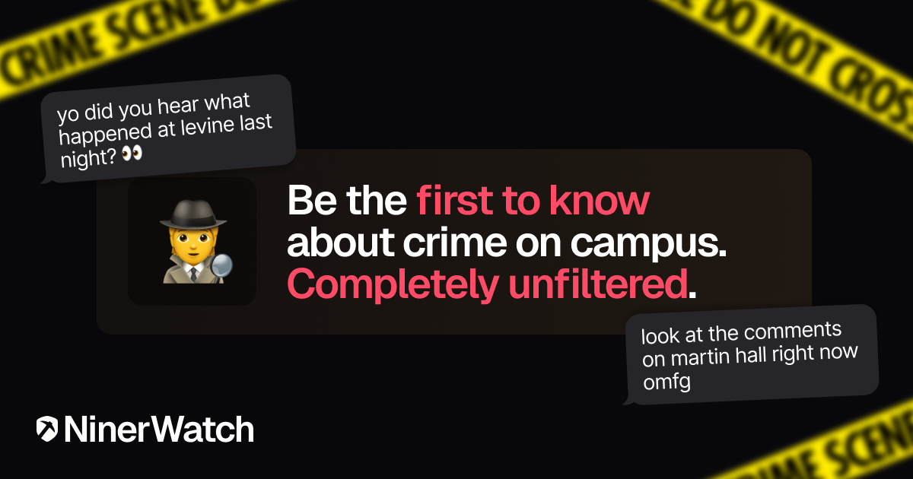

# NinerWatch 🕵️

<div align="center">
  
  
  <h3>Campus Safety Dashboard for UNC Charlotte</h3>

  <p>
    <a href="#features">Features</a> •
    <a href="#live-demo">Live Demo</a> •
    <a href="#screenshots">Screenshots</a> •
    <a href="#tech-stack">Tech Stack</a> •
    <a href="#getting-started">Getting Started</a> •
    <a href="#development">Development</a> •
    <a href="#environment-variables">Environment Variables</a> •
    <a href="#license">License</a>
  </p>
  
  
  
  
  
</div>

## Overview

NinerWatch is a real-time campus safety monitoring platform for UNC Charlotte students, faculty, and community members. It aggregates, visualizes, and provides a discussion platform for campus police reports and safety incidents.

> 🚨 **DISCLAIMER:** NinerWatch is not affiliated with or endorsed by UNC Charlotte. This is an unofficial service created to aggregate and display publicly available campus safety information.

## Features

🗺️ **Interactive Campus Map** - Visualize incident locations across campus  
📊 **Safety Statistics** - Analyze trends and patterns in campus safety data  
💬 **Community Discussion** - Anonymous commenting on incident reports  
🔔 **Live News Ticker** - Latest campus safety news and alerts  
📱 **Mobile Responsive** - Access on any device with a responsive UI  
🕒 **Real-time Updates** - Automatically refreshes with new incident data  
📈 **Analytics Dashboard** - Visual breakdowns of incident categories and hotspots  
📑 **Detailed Incident Reports** - Comprehensive information for each event  
🌙 **Dark Mode** - Eye-friendly dark theme for better night viewing

## Live Demo

Visit the live demo at [https://ninerwatch.org/](https://ninerwatch.org/)

## Screenshots

<div align="center">
  
  
</div>

<div align="center">
  
</div>

## Tech Stack

- **Frontend**: [Next.js 15](https://nextjs.org/), [React 19](https://react.dev/), [TypeScript](https://www.typescriptlang.org/)
- **Styling**: [Tailwind CSS](https://tailwindcss.com/), [shadcn/ui](https://ui.shadcn.com/)
- **Database**: [Supabase](https://supabase.com/) (Postgres)
- **Maps**: [Leaflet](https://leafletjs.com/), [React Leaflet](https://react-leaflet.js.org/)
- **Data Processing**: GitHub Actions, Python
- **Deployment**: [Vercel](https://vercel.com/)

## Getting Started

### Prerequisites

- Node.js 20+
- bun, pnpm, npm, or yarn
- A Supabase account

### Installation

1. Clone the repository

   ```bash
   git clone https://github.com/yourusername/ninerwatch.git
   cd ninerwatch
   ```

2. Install dependencies

   ```bash
   bun install
   # or
   pnpm install
   # or
   npm install
   # or
   yarn install
   ```

3. Set up environment variables (see [Environment Variables](#environment-variables))

4. Run the development server

   ```bash
   bun run dev
   # or
   pnpm run dev
   # or
   npm run dev
   # or
   yarn dev
   ```

5. Open [http://localhost:3000](http://localhost:3000) with your browser to see the result

## Development

### Project Structure

```
├── .github/           # GitHub Actions workflows
├── public/            # Static files
├── scripts/           # Python scripts for data processing
├── src/
│   ├── app/           # Next.js App Router
│   ├── components/    # React components
│   │   ├── dashboard/ # Dashboard-specific components
│   │   ├── map/       # Map-related components
│   │   └── ui/        # UI components
│   ├── context/       # React context providers
│   └── lib/           # Utility functions and API clients
```

### Data Flow

1. GitHub Actions run on an hourly schedule to fetch new police logs
2. Python scripts parse PDF files and extract incident information
3. Data is stored in Supabase database
4. Next.js frontend retrieves and displays the data in real-time

## Environment Variables

Create a `.env` file in the root directory with the following variables:

```env
NEXT_PUBLIC_SUPABASE_URL=your_supabase_url
NEXT_PUBLIC_SUPABASE_ANON_KEY=your_supabase_anon_key
```

## Supabase Schema

The application requires two main tables:

### crime_incidents

- `id` (uuid, primary key)
- `report_number` (text)
- `incident_type` (text)
- `incident_location` (text)
- `date_reported` (date)
- `time_reported` (timestamp)
- `time_secured` (timestamp, nullable)
- `time_of_occurrence` (timestamp, nullable)
- `disposition` (text, nullable)
- `incident_description` (text, nullable)
- `created_at` (timestamp, default: now())

### incident_comments

- `id` (uuid, primary key)
- `incident_id` (uuid, foreign key to crime_incidents.id)
- `parent_id` (uuid, nullable, self-referential)
- `reply_to_id` (uuid, nullable)
- `comment_text` (text)
- `user_color` (text)
- `votes` (integer, default: 0)
- `created_at` (timestamp, default: now())

## Contributing

Contributions are welcome! Please feel free to submit a Pull Request.

1. Fork the repository
2. Create your feature branch (`git checkout -b feature/new-feature`)
3. Commit your changes (`git commit -m 'Add new feature'`)
4. Push to the branch (`git push origin feature/new-feature`)
5. Open a Pull Request

## License

This project is licensed under the CC Attribution-NonCommercial-ShareAlike 4.0 International License - see the LICENSE file for details.

## Acknowledgements

- Data source: [UNC Charlotte Police Department](https://police.charlotte.edu/)
- Map tiles: [CartoDB](https://carto.com/)
- Icons from [Lucide](https://lucide.dev/)
- UI components based on [shadcn/ui](https://ui.shadcn.com/)

---

<div align="center">
  <p>
    <a href="https://github.com/brandonsaldan/ninerwatch/issues">Report Bug</a> •
    <a href="https://github.com/brandonsaldan/ninerwatch/issues">Request Feature</a>
  </p>
</div>
